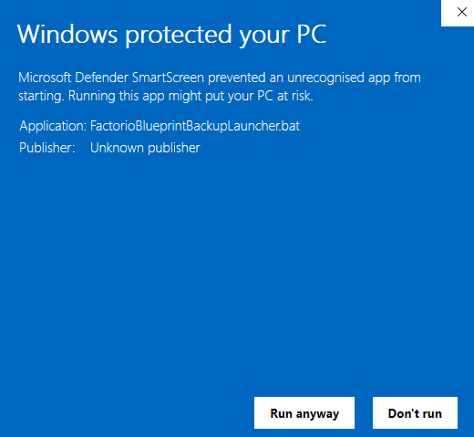

# FactorioBlueprintBackup


[](https://ko-fi.com/K3K115GNK4)

## Description

On game startup from Steam, a backup of **blueprint-storage.dat** is taken.  It maintians the last 10 timestamped backups, and the oldest is removed.

## Setup on Windows

- Download **FactorioBlueprintBackup-win.zip** from [Releases](https://github.com/TrisBits/FactorioBlueprintBackup/releases).
- Unzip the file.
- Copy the entire folder **FactorioBlueprintBackup** to your Factorio Steam Library location.  For example the default is **C:\Program Files (x86)\Steam\steamapps\common\Factorio**.
- In the Steam client, go to the Factorio Library entry.
  - Select **Manage** (the Gear icon), and open **Properties**.
  - Under **LAUNCH OPTIONS**, enter the full path to **FactorioBlueprintBackupLauncher.bat** in double-quotes followed by **%command%**.

    Example:

    ```bash
    "C:\Program Files (x86)\Steam\steamapps\common\Factorio\FactorioBlueprintBackup\FactorioBlueprintBackupLauncher.bat" %command%
    ```

- Start Factorio to verify the setup is working. A new directory should now be present in the save file location **%appdata%\Factorio**, named **blueprint-backups**. <br>
  Inside the **blueprint-backups** directory, you will find folders timestamped with Factorio startup times.  Inside each timestamped folder will be a backup copy of the **blueprint-storage.dat** file, taken at that time.

## FAQ

- On the first use, Windows may produce the following warning.  Simply select **Run Anyway**.  It should not prompt on subsequent executions.

  
